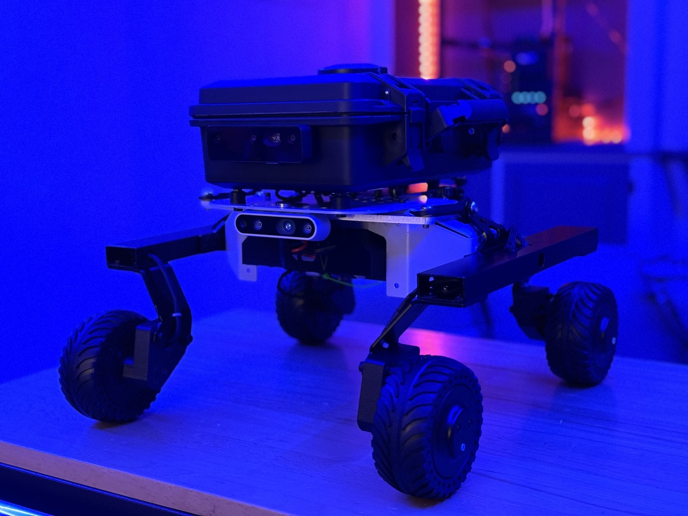
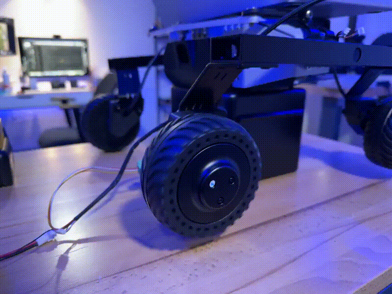

# Robot 4wd DDSM115 base controller

This repository contains the Rover Base Controller, a ROS package for controlling a 4WD mobile robot equipped with DDSM115 motors. The package provides velocity control via /cmd_vel, reads motor feedback for RPM and current, and publishes odometry for localization.



## Features

- **Velocity Control**: Subscribes to `/cmd_vel` and converts Twist messages into motor RPM commands.
- **Motor Feedback**: Reads **RPM and current** from each motor and publishes them on `/ddsm115_rpms` and `/ddsm115_currents`.
- **Odometry Computation**: Integrates wheel speeds to estimate the robot's position and publishes it on `/wheel_odom`.
- **ROS Compatibility**: Designed for **ROS Noetic** on **Ubuntu 20.04**, compatible with `teleop_twist_keyboard` for manual control.
- **Configurable Parameters**: Supports YAML-based configuration for motor IDs, wheel directions, robot dimensions, and control loop frequency.



### DDSM115 library

Python library to talk with the DDSM115 coming from this repo with some modifications: 
[ros_ddsm115_driver](https://github.com/belovictor/ros_ddsm115_driver)

## Installation & Usage

### 1. Clone into Catkin Workspace
```bash
cd ~/catkin_ws/src
git clone https://github.com/alduxvm/robot_4wd_dds115_base_controller
cd ~/catkin_ws
catkin_make
source devel/setup.bash
```

### 2. Launch the Base Controller
```bash
roslaunch robot_4wd_dds115_base_controller base_controller.launch 
```

### 3. Control the Robot via Teleop
```bash
rosrun teleop_twist_keyboard teleop_twist_keyboard.py
```

### 4. Monitor Motor Feedback & Odometry
```bash
rostopic echo /wheel_odom
rostopic echo /ddsm115_rpms
rostopic echo /ddsm115_currents
```

## Configuration

The parameters for the controller are stored in a YAML file (`base_controller.yaml`), allowing customization:

```yaml
base_controller:
  wheel_names: ["front_left_wheel", "front_right_wheel", "rear_left_wheel", "rear_right_wheel"]
  wheel_ids: [1, 2, 3, 4]
  wheel_directions: ["forward", "backward", "forward", "backward"]
  wheel_radius: 0.1        # meters
  wheel_track: 0.33         # meters (distance between left & right wheels)
  wheel_base: 0.33          # meters (distance between front & rear wheels)
  feedback_rate: 100       # Hz
  device_path: "/dev/ttyUSB0"
```

## Repository Structure

```
rover_base_controller/
├── CMakeLists.txt
├── package.xml
├── README.md
├── config
│   └── base_controller.yaml
├── launch
│   └── base_controller.launch
├── scripts
│   └── base_controller_node.py
└── ddsm115
    ├── __init__.py
    └── ddsm115.py
```
