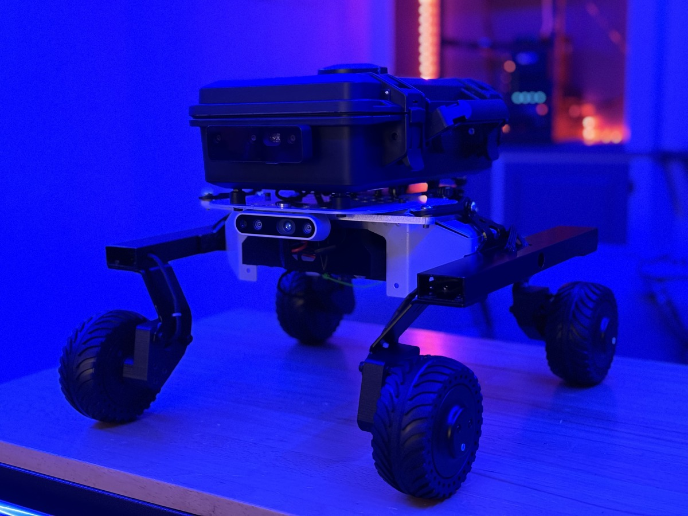
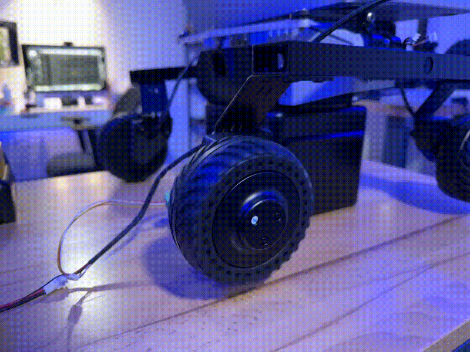

# Robot 4WD DDSM115 Base Controller

A ROS Noetic package for controlling a 4WD mobile robot equipped with DDSM115 brushless hub motors over RS485. The driver was originally written in Python and has been **fully rewritten in C++** for improved timing reliability, lower CPU usage, and smoother motion control.



## What's New in v2 (C++ Rewrite)

The original Python driver worked but had known issues with RS485 bus collisions during movement, causing CRC errors, jerky stops, and unresponsive turns. The C++ rewrite fixes all of these at the architecture level:

- **Threaded TX/Feedback architecture** — command sending and motor feedback polling run on separate threads protected by a mutex. The bus is never accessed from two places at once.
- **RS485 collision fix** — a configurable inter-command gap (default 4ms) ensures each motor's reply fully clears the bus before the next command is sent. Eliminates the CRC errors that plagued the Python version.
- **Velocity ramp** — acceleration and deceleration are rate-limited (configurable RPM/s). No more abrupt stops or direction-change jerks.
- **Non-blocking cmd_vel callback** — the ROS subscriber callback just stores the commanded velocity and signals the TX thread. It never blocks on serial I/O, so the ROS queue never backs up.
- **Watchdog** — if no `/cmd_vel` is received within a configurable timeout, all motors are commanded to zero. Keeps the robot safe if the controller disconnects.
- **Pure differential kinematics** — clean left/right velocity calculation with no threshold hacks.
- **CRC on all commands** — including `set_drive_mode`, which was missing CRC in the original.
- **Significantly lower CPU usage** — idle CPU dropped from ~30% to near 0%.



## Features

- **Velocity Control** — subscribes to `/cmd_vel` (Twist) and converts to per-motor RPM commands with smooth ramping
- **Motor Feedback** — reads RPM and current from each motor at a configurable rate, publishes on `/motor_rpms` and `/motor_currents`
- **Odometry** — integrates wheel encoder feedback to estimate position, publishes on `/wheel_odom` with covariance
- **TF broadcast** — publishes `odom → base_link` transform
- **Configurable** — all parameters via YAML: wheel geometry, motor IDs/directions, serial device, ramp rate, feedback rate, watchdog timeout
- **ROS Noetic** on Ubuntu 20.04, compatible with `teleop_twist_keyboard` and any standard `/cmd_vel` source

## Hardware

- **Motors**: DDSM115 brushless hub motors (IDs 1–4)
- **Interface**: RS485 at 115200 baud via FTDI FT232R USB adapter (`/dev/rs485`)
- **Protocol**: proprietary RS485 frame with CRC-8/MAXIM checksum
- **Motor layout**: FL=1 (forward), FR=2 (backward), RL=3 (forward), RR=4 (backward)

Reference: [Waveshare DDSM115 wiki](https://www.waveshare.com/wiki/DDSM115)  
Inspired by: [belovictor/ros_ddsm115_driver](https://github.com/belovictor/ros_ddsm115_driver)

## Installation

```bash
# Clone into your catkin workspace
cd ~/rover_ws/src
git clone https://github.com/alduxvm/robot_4wd_dds115_base_controller

# Install the serial dependency
sudo apt install ros-noetic-serial

# Build
cd ~/rover_ws
catkin_make
source devel/setup.bash
```

## Usage

### Launch the base controller

```bash
roslaunch robot_4wd_dds115_base_controller base_controller.launch
```

### Keyboard teleoperation

```bash
rosrun teleop_twist_keyboard teleop_twist_keyboard.py
```

### Monitor topics

```bash
rostopic echo /wheel_odom
rostopic echo /motor_rpms
rostopic echo /motor_currents
```

## Configuration

All parameters are in `config/base_controller.yaml`:

```yaml
base_controller:
  wheel_ids:        [1, 2, 3, 4]
  wheel_directions: ["forward", "backward", "forward", "backward"]
  wheel_radius:     0.05            # meters
  wheel_track:      0.33            # meters (left-right distance)
  wheel_base:       0.33            # meters (front-rear distance)
  device_path:      "/dev/rs485"    # udev symlink for the RS485 adapter
  feedback_rate_hz: 10.0            # Hz — motor feedback polling rate
  cmd_vel_timeout:  1.5             # seconds — watchdog (0 = disabled)
  inter_cmd_gap_ms: 4               # ms between motor commands (RS485 turnaround)
  accel_rpm_per_sec: 400.0          # RPM/s ramp rate for acceleration/deceleration
```

### udev rule for the RS485 adapter

Create `/etc/udev/rules.d/99-usb-serial.rules`:

```bash
# FTDI FT232 RS485 adapter
SUBSYSTEM=="tty", ATTRS{idVendor}=="0403", ATTRS{idProduct}=="6001", SYMLINK+="rs485"
```

Then reload: `sudo udevadm control --reload-rules && sudo udevadm trigger`

## Repository Structure

```
robot_4wd_dds115_base_controller/
├── CMakeLists.txt
├── package.xml
├── README.md
├── config/
│   └── base_controller.yaml
├── launch/
│   └── base_controller.launch
├── include/robot_4wd_dds115_base_controller/
│   └── ddsm115_protocol.hpp      # Frame building, CRC, parsing
├── src/
│   ├── ddsm115_protocol.cpp
│   └── base_controller_node.cpp  # C++ ROS node (threaded TX/feedback)
├── scripts/
│   └── base_controller_node.py   # Legacy Python node (kept for reference)
├── ddsm115/
│   └── ddsm115.py                # Legacy Python library
└── images/
```

## ROS Topics

| Topic | Type | Description |
|---|---|---|
| `/cmd_vel` | `geometry_msgs/Twist` | Velocity command input |
| `/wheel_odom` | `nav_msgs/Odometry` | Wheel encoder odometry |
| `/motor_rpms` | `std_msgs/Float32MultiArray` | Motor RPM feedback [FL, FR, RL, RR] |
| `/motor_currents` | `std_msgs/Float32MultiArray` | Motor current draw [FL, FR, RL, RR] (A) |
